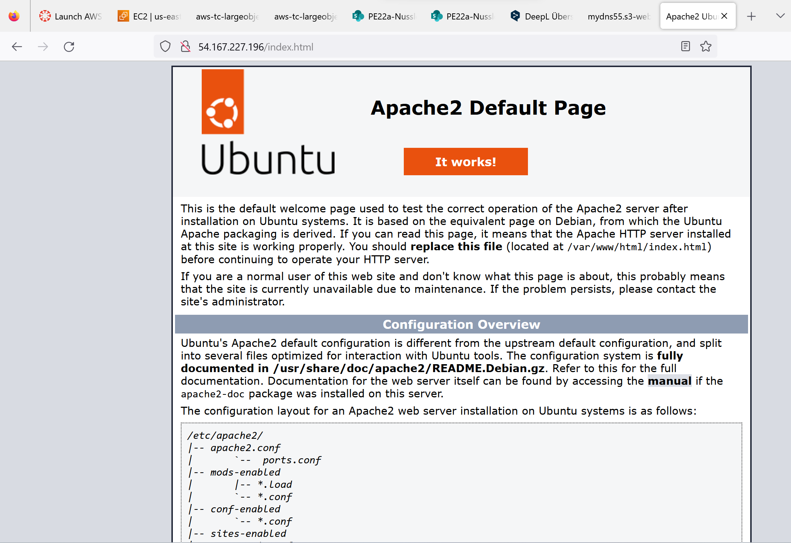
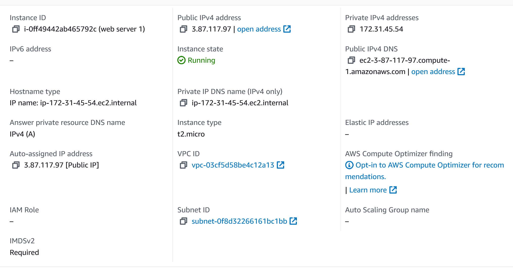

# A) Lab 4.1 - EC2

- Führen Sie alle Schritte durch. Sie erstellen die Screenshots der verschiedenen Bereiche für Ihre
Abgabe nachdem Sie alle Schritte des Moduls durchgeführt haben. Screenshots:

## HTML-Seite, inkl. URL

Hier ist die Liste der EC2-Instanz

## Liste der EC2-Instanzen

## Details der Web Server-Instanz (öffentliche IP sichtbar)

## Security-Group: Liste der Inbound-Regeln.

# A) Lab 4.2 - S3

- Führen Sie alle Schritte durch. Sie erstellen die Screenshots der verschiedenen Bereiche für Ihre
Abgabe nachdem Sie alle Schritte des Moduls durchgeführt haben. Screenshots:

## Liste der Buckets.

## HTML-Seite, inkl. URL.

## Liste der Dateien im Bucket.

## Eigenschaften von "Static website hosting".

# B) Zugriff mit SSH-Key

## Screenshot mit dem ssh-Befehl und des Resultats unter Verwendung des ersten Schlüssels

## Screenshot mit dem ssh-Befehl und des Resultats unter Verwendung des zweiten Schlüssels

## Screenshot der Instanz-Detail (oder Liste), so dass der verwendete Schlüssel sichtbar ist.

# C) Installation von Web- und Datenbankserver

## Erstellen Sie Screenshots der funktionierenden Webseiten (mit sichtbarer URL)

## Diese URL zeigt ihnen die Informationen von Apache an. Wenn die Seite funktioniert, zeigt dies, dass Apache installiert wurde und funktioniert.

## Diese URL zeigt ihnen die Informationen von PHP an. Wenn diese Seite funktioniert, zeigt dies, dass das PHP-Modul funktioniert und Sie nun dynamische Seiten hosten können.

## Diese URL zeigt ihnen die Datenbank-Benutzer. Wenn diese Seite funktioniert, zeigt es Ihnen, dass die Datenbank-Verbindung funktioniert.

