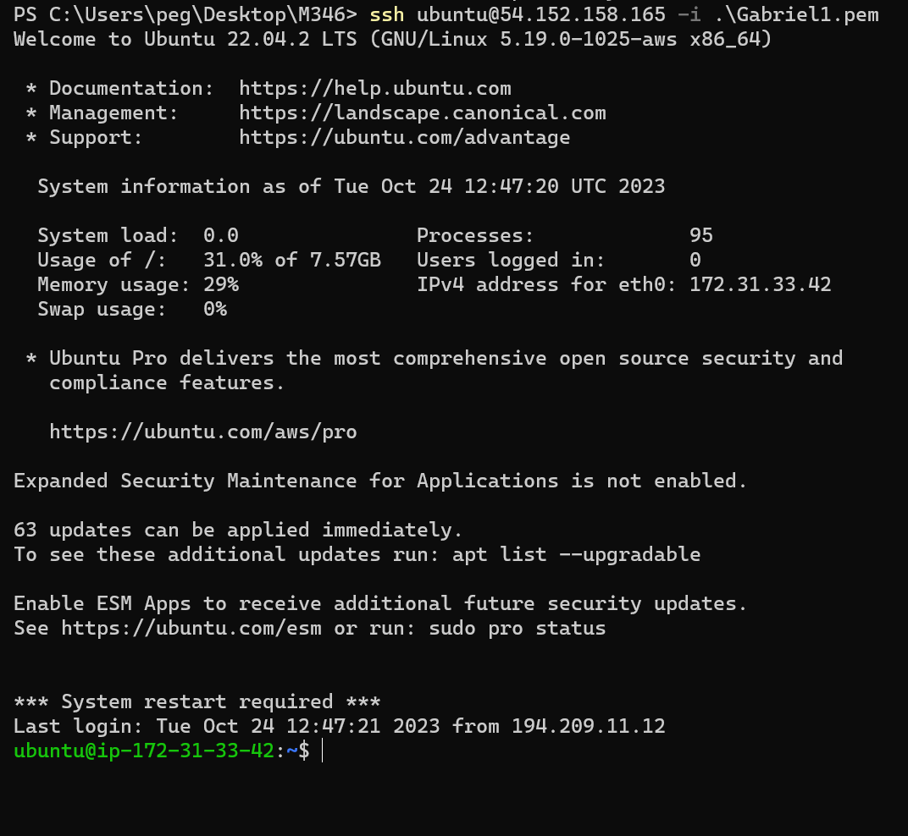
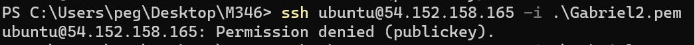
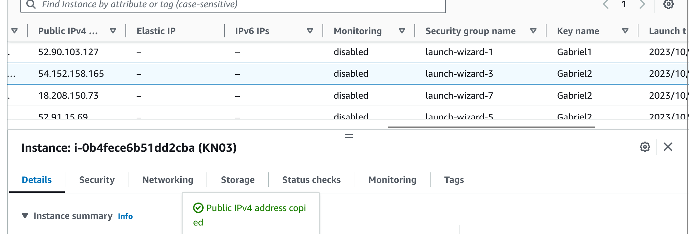
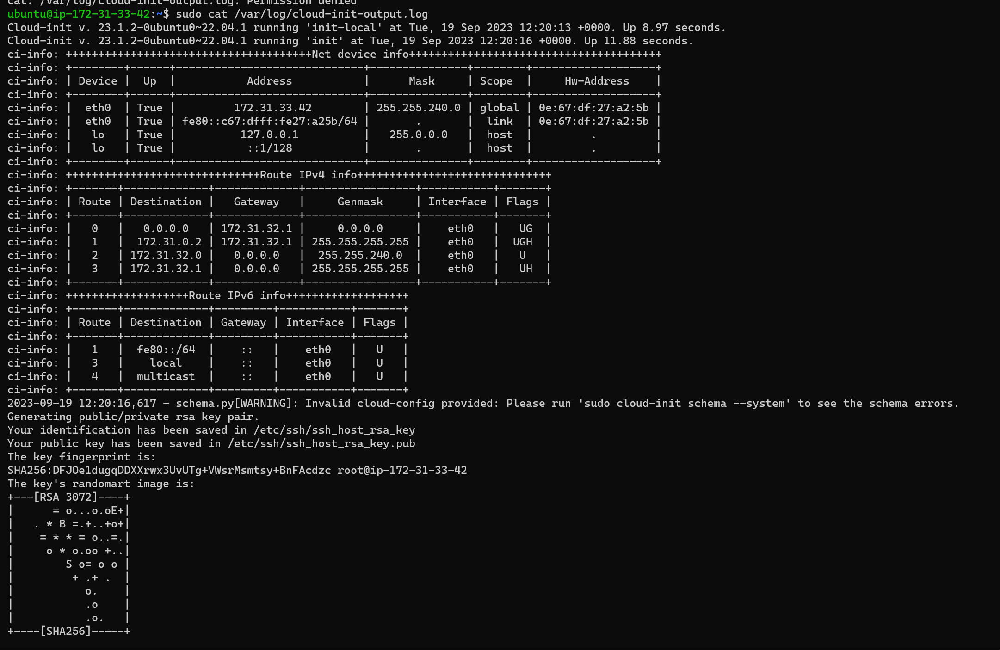

## Hier noch die richtige weise mit dem 2ten key aber man kommt mit dem ersten rein.

## Ihre angepasste Cloud-init Konfiguration als Datei im Git-Repository.

cloud-init.yaml

## Ein Screenshot der Details oder Liste der Instanz, welcher den verwendeten Key zeigt.

## Screenshot mit dem ssh-Befehl und des Resultats unter Verwendung des ersten Schlüssels.

## Screenshot mit dem ssh-Befehl und des Resultats unter Verwendung des zweiten Schlüssels.

## Screenshot mit dem Auszug aus dem Cloud-Init-Log.

