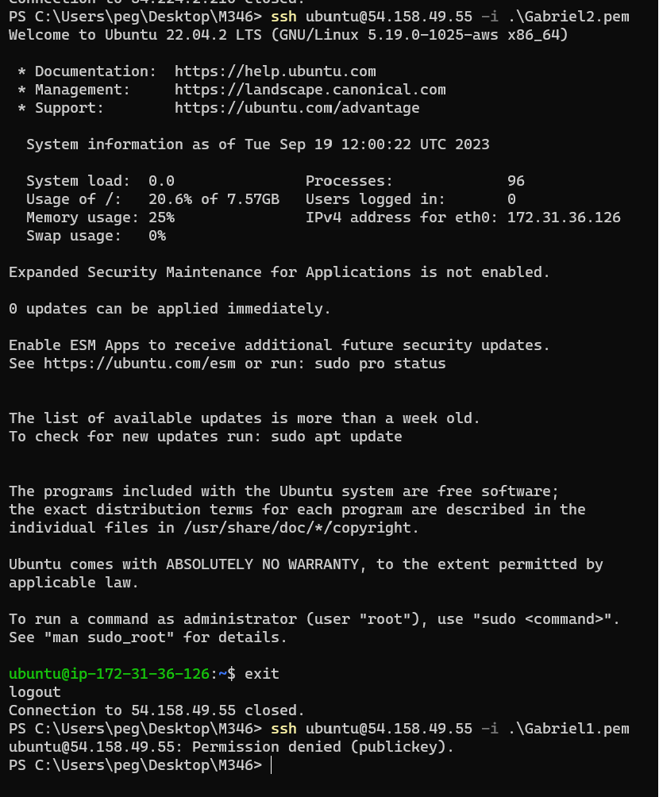

#Ihre angepasste Cloud-init Konfiguration als Datei im Git-Repository.

cloud-init.yaml

#Ein Screenshot der Details oder Liste der Instanz, welcher den verwendeten Key zeigt.

#Screenshot mit dem ssh-Befehl und des Resultats unter Verwendung des ersten Schlüssels.

#Screenshot mit dem ssh-Befehl und des Resultats unter Verwendung des zweiten Schlüssels.

#Screenshot mit dem Auszug aus dem Cloud-Init-Log.