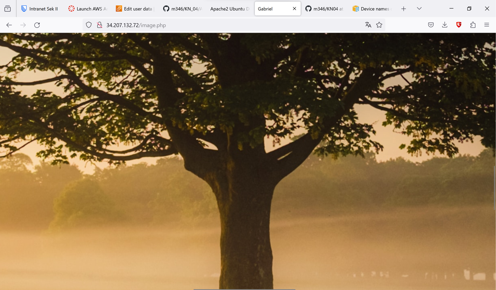

## A) Bild erstellen und auf S3 hosten

Abgaben:
• Screenshot der S3-Objekte im Bucket

• Screenshot des Bildes im Browser (mit sichtbarer URL)

## B) Web-Server mit PHP-Seite hinzufügen

Abgaben:
• Neues Cloud-Init für die Web-Instanz

Aufgabe_B.yaml

• Screenshot der Seite image.php (mit sichtbarer URL)

## C) Elastic Block Storage (EBS) hinzufügen.

Abgaben:
• Screenshots der Liste der EBS (2 Volumen) der Instanz. Alle Spalten sollen sichtbar sein.

## D) Speichereigenschaften erkennen

Abgaben
• Kategorisierung

| Volume | Typ | Persistenz |
| - | - | - |
|EBS Root|Hot|Nein|
|EBS Zusätzliches Volumen|Hot|Ja|
|S3|Warm|Ja|

• Erklärung/Begründung zu der Kategorisierung.

Das EBS-Root-Volume ist "Hot", weil es wichtig für die Instanz ist und ständig benutzt wird.

Das zusätzliche EBS-Volume ist auch "Hot", weil die Instanz es oft und intensiv für spezielle Aufgaben nutzt.

Der S3-Speicher ist "Warm", da es schwierig vorherzusagen ist, wie viele Leute gleichzeitig auf eine Website zugreifen werden.