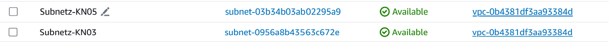
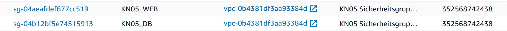

## A) Diagramm erstellen

Abgaben:
Diagramm als Bild

## B) Subnetz und private IP wählen

Abgaben:
Screenshot der Subnetzen, die die Namen zeigen

Zwei definierte IPs für Web- und DB-Server/Instanz. Dazu braucht es keinen Screenshot,
einfach nur die beiden IPs als Text.

Datenbank IP-Adresse: 172.31.46.155
Webserver IP-Adresse: 172.31.46.233
## C) Objekte und Instanzen erstellen

Abgaben

-Screenshot der Liste der Sicherheitsgruppe mit sprechenden Namen/Feldern

-Screenshot der Inbound-Regel für die DB-Sicherheitsgruppe.

