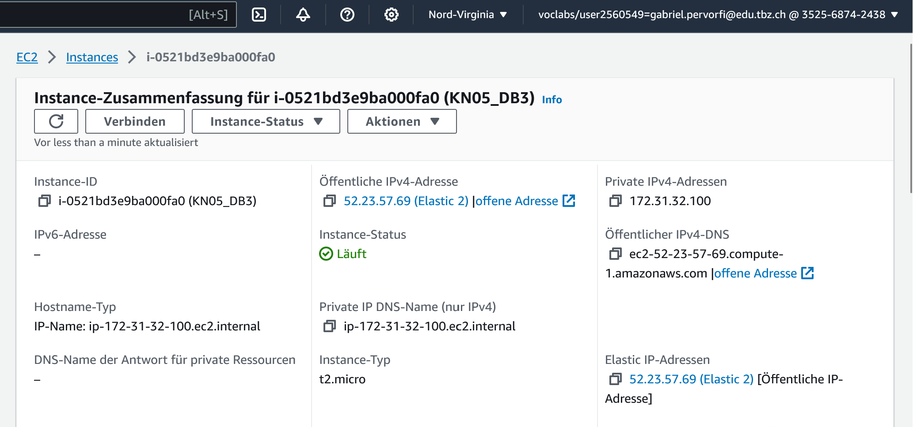
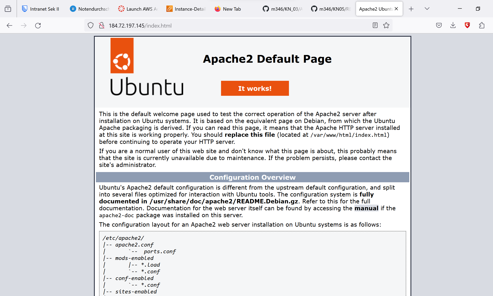
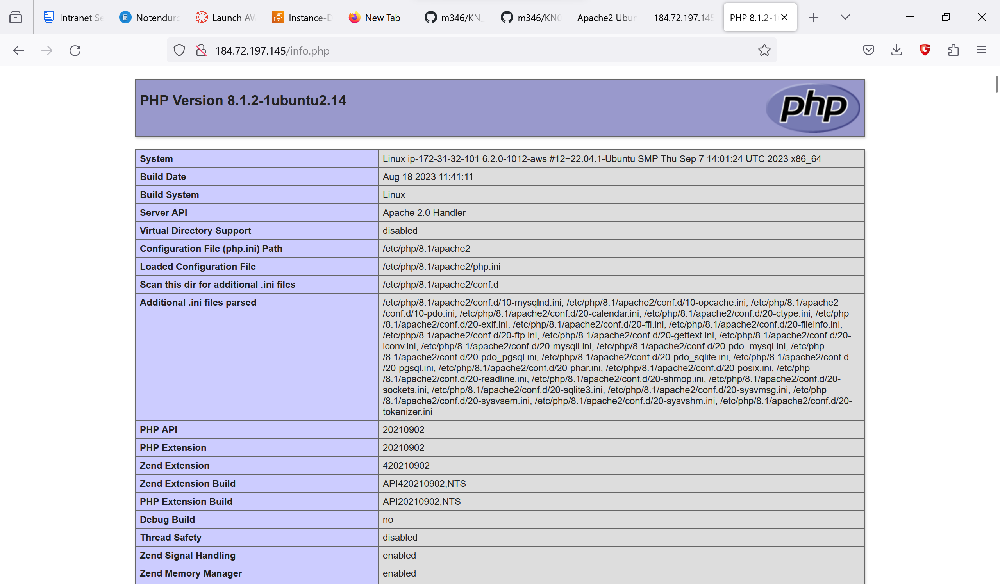
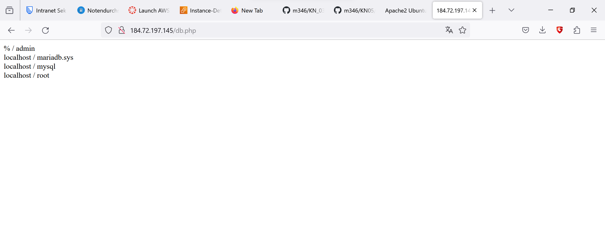
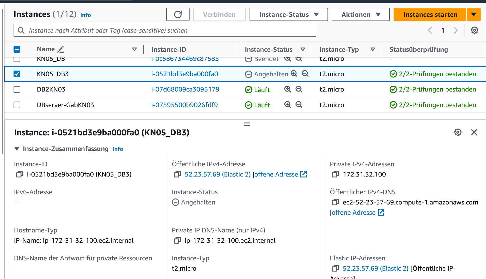
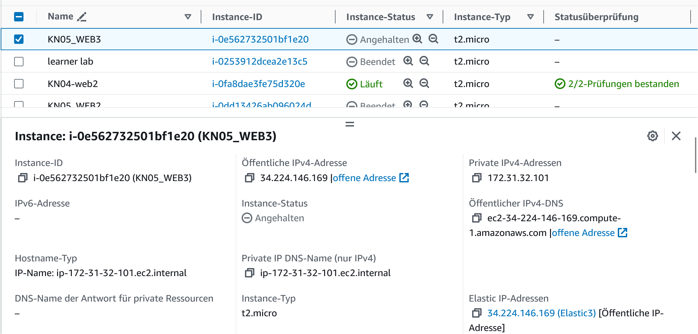
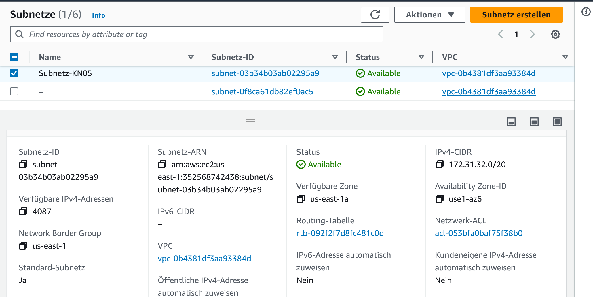

## A) Diagramm erstellen

Abgaben:
Diagramm als Bild

## B) Subnetz und private IP wählen

Abgaben:
Screenshot der Subnetzen, die die Namen zeigen

Zwei definierte IPs für Web- und DB-Server/Instanz. Dazu braucht es keinen Screenshot,
einfach nur die beiden IPs als Text.

Datenbank IP-Adresse: 172.31.32.100
Webserver IP-Adresse: 172.31.32.101
## C) Objekte und Instanzen erstellen

Abgaben

-Screenshot der Liste der Sicherheitsgruppe mit sprechenden Namen/Feldern

-Screenshot der Inbound-Regel für die DB-Sicherheitsgruppe.

-Screenshot der Liste der Elastic IPs mit sprechenden Namen.

-Zeigen Sie, dass Sie nun alle drei Seiten aufrufen können (index.html, info.php und db.php).

-Screenshot der Liste der Instanzen, wenn beide Instanzen gestoppt sind. Das Feld der
öffentlichen IP und der Status (gestoppt) müssen sichtbar sein.

-Screenshot der Details beider Instanzen, so dass die Subnet ID sichtbar ist.

