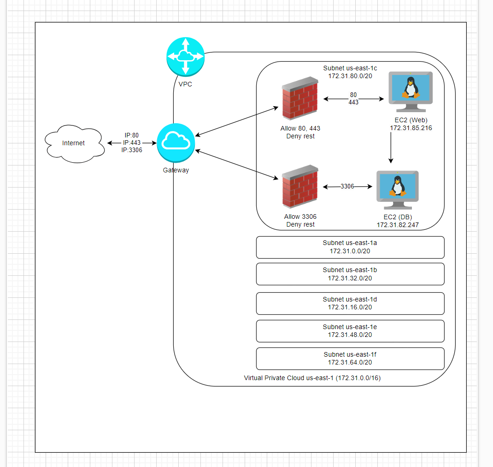

## A) Diagramm erstellen

Abgaben:
Diagramm als Bild

## B) Subnetz und private IP wählen

Abgaben:
Screenshot der Subnetzen, die die Namen zeigen

Zwei definierte IPs für Web- und DB-Server/Instanz. Dazu braucht es keinen Screenshot,
einfach nur die beiden IPs als Text.

Datenbank IP-Adresse: 172.31.32.100
Webserver IP-Adresse: 172.31.32.101
## C) Objekte und Instanzen erstellen

Abgaben

-Screenshot der Liste der Sicherheitsgruppe mit sprechenden Namen/Feldern

-Screenshot der Inbound-Regel für die DB-Sicherheitsgruppe.

-Screenshot der Liste der Elastic IPs mit sprechenden Namen.

-Zeigen Sie, dass Sie nun alle drei Seiten aufrufen können (index.html, info.php und db.php).

-Screenshot der Liste der Instanzen, wenn beide Instanzen gestoppt sind. Das Feld der
öffentlichen IP und der Status (gestoppt) müssen sichtbar sein.

-Screenshot der Details beider Instanzen, so dass die Subnet ID sichtbar ist.

-Laden Sie die aktualisierten Cloud-init Konfigurationen hoch in Git. Im Web-Konfig, sollte die

IP angepasst sein.
#cloud-config
users:
  - name: ubuntu
    sudo: ALL=(ALL) NOPASSWD:ALL
    groups: users, admin
    home: /home/ubuntu
    shell: /bin/bash
    ssh_authorized_keys:
    - ssh-rsa AAAB3NzaC1yc2EAAAADAQABAAABAQC0WGP1EZykEtv5YGC9nMiPFW3U3DmZNzKFO5nEu6uozEHh4jLZzPNHSrfFTuQ2GnRDSt+XbOtTLdcj26+iPNiFoFha42aCIzYjt6V8Z+SQ9pzF4jPPzxwXfDdkEWylgoNnZ+4MG1lNFqa8aO7F62tX0Yj5khjC0Bs7Mb2cHLx1XZaxJV6qSaulDuBbLYe8QUZXkMc7wmob3PM0kflfolR3LE7LResIHWa4j4FL6r5cQmFlDU2BDPpKMFMGUfRSFiUtaWBNXFOWHQBC2+uKmuMPYP4vJC9sBgqMvPN/X2KyemqdMvdKXnCfrzadHuSSJYEzD64Cve5Zl9yVvY4AqyBD aws-key
    - ssh-rsa AAAAB3NzaC1yc2EAAAADAQABAAABAQCLEuXwRbTzsqDElJvbZqIGhJ1swPBj71hEiATCyFjD9iw6LdR1bHBjWM3XOyX8+TqIJDOSrvN75CY8w9DJnVlPA1u4byOPSXNzYrInJ1WSqxwvdCF3QB2H3MlEFO2b6JsreTjuzFjKxUucVSvEMw8t3YcA0SHcNCfiywSB0dldoYmoylOMP6QhYInm1m3HLEdVveKLqQQl9XJhK2UwgcZZQdtW9wzL+8Axwe9nmGJxiHFHZwKdvxbsK8BbXQNIafqReGafSqlSloy04CZgIzJ35fUjb+d6WxqfEkJzPCxy24Rrh/m+PueMyJSGW+3hf9KtzDGPtxOZiRFC3+pkNR4L aws-key
ssh_pwauth: false
disable_root: false 
package_update: true
packages:
  - curl 
  - wget 
  - mariadb-server

runcmd:
  - mysql -sfu root -e "GRANT ALL ON *.* TO 'admin'@'%' IDENTIFIED BY 'password' WITH GRANT OPTION;"
  - sed -i 's/127.0.0.1/0.0.0.0/g' /etc/mysql/mariadb.conf.d/50-server.cnf
  - systemctl restart mariadb.service

  Hier noch WEBServer Cloud-Init

#cloud-config
users:
  - name: ubuntu
    sudo: ALL=(ALL) NOPASSWD:ALL
    groups: users, admin
    home: /home/ubuntu
    shell: /bin/bash
    ssh_authorized_keys:
    - ssh-rsa AAAB3NzaC1yc2EAAAADAQABAAABAQC0WGP1EZykEtv5YGC9nMiPFW3U3DmZNzKFO5nEu6uozEHh4jLZzPNHSrfFTuQ2GnRDSt+XbOtTLdcj26+iPNiFoFha42aCIzYjt6V8Z+SQ9pzF4jPPzxwXfDdkEWylgoNnZ+4MG1lNFqa8aO7F62tX0Yj5khjC0Bs7Mb2cHLx1XZaxJV6qSaulDuBbLYe8QUZXkMc7wmob3PM0kflfolR3LE7LResIHWa4j4FL6r5cQmFlDU2BDPpKMFMGUfRSFiUtaWBNXFOWHQBC2+uKmuMPYP4vJC9sBgqMvPN/X2KyemqdMvdKXnCfrzadHuSSJYEzD64Cve5Zl9yVvY4AqyBD aws-key
    - ssh-rsa AAAAB3NzaC1yc2EAAAADAQABAAABAQCLEuXwRbTzsqDElJvbZqIGhJ1swPBj71hEiATCyFjD9iw6LdR1bHBjWM3XOyX8+TqIJDOSrvN75CY8w9DJnVlPA1u4byOPSXNzYrInJ1WSqxwvdCF3QB2H3MlEFO2b6JsreTjuzFjKxUucVSvEMw8t3YcA0SHcNCfiywSB0dldoYmoylOMP6QhYInm1m3HLEdVveKLqQQl9XJhK2UwgcZZQdtW9wzL+8Axwe9nmGJxiHFHZwKdvxbsK8BbXQNIafqReGafSqlSloy04CZgIzJ35fUjb+d6WxqfEkJzPCxy24Rrh/m+PueMyJSGW+3hf9KtzDGPtxOZiRFC3+pkNR4L aws-key
ssh_pwauth: false
disable_root: false 
package_update: true
packages:
  - curl 
  - wget 
  - apache2
  - php
  - libapache2-mod-php
  - php-mysqli
  - adminer

write_files:
  - path: /var/www/html/db.php
    content: |
      <?php
              //database
              $servername = "172.31.32.100";
              $username = "admin";
              $password = "password";
              $dbname = "mysql";

              // Create connection
              $conn = new mysqli($servername, $username, $password, $dbname);
              // Check connection
              if ($conn->connect_error) {
                      die("Connection failed: " . $conn->connect_error);
              }

              $sql = "select Host, User from mysql.user;";
              $result = $conn->query($sql);
              while($row = $result->fetch_assoc()){
                      echo($row["Host"] . " / " . $row["User"] . " ");
              }
              //var_dump($result);
      ?>
  - path: /var/www/html/info.php
    content: |
      <?php
      // Show all information, defaults to INFO_ALL
      phpinfo();
      ?>

runcmd:
  - a2enconf adminer
  - systemctl restart apache2

