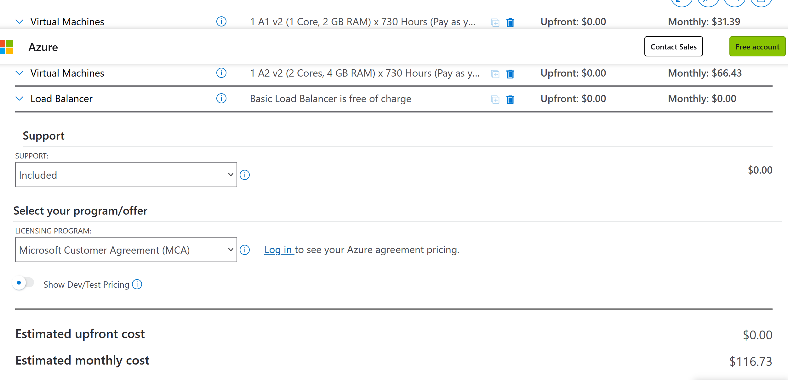
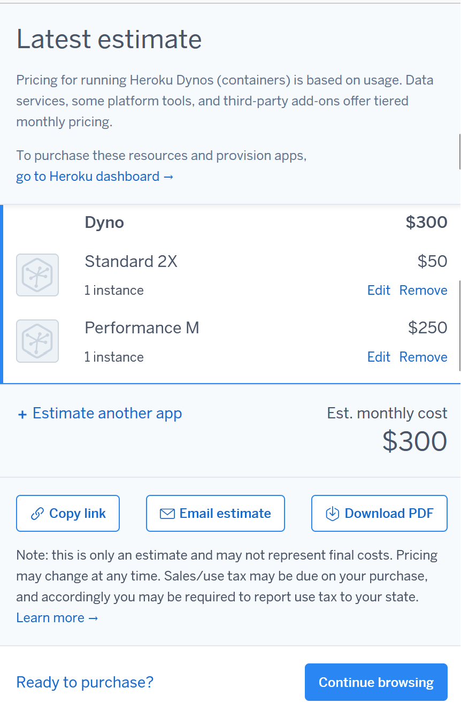
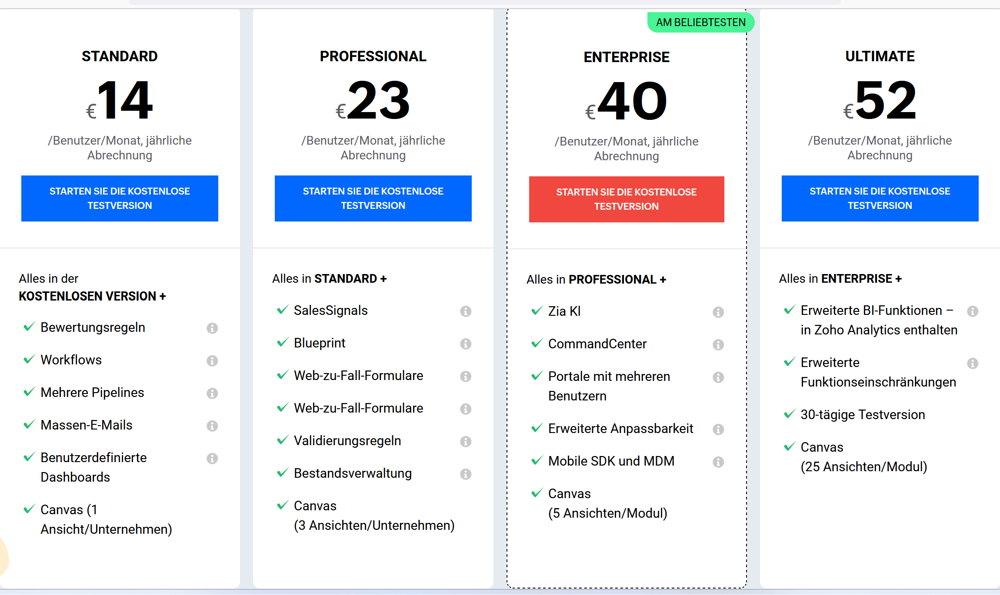
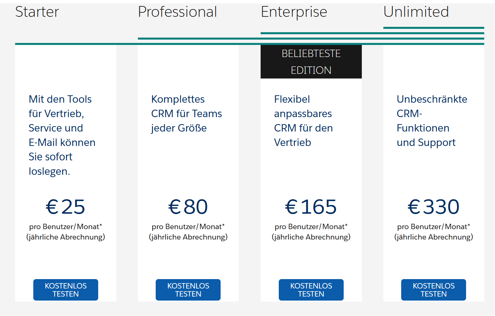

## 1) Rehosting

#### • Screenshot der Kostenrechnungen:

#### • Erklärung zu der Auswahl, so dass die Auswahl schlüssig ist.

Ich habe mich für diese Instanzen entschieden, weil sie am kostengünstigsten waren und genug für einen kleinen Betrieb anboten. Da ich dies zum ersten Mal selbst gemacht habe, sind meine Instanzen keinesfalls perfekt. Allerdings habe ich darauf geachtet, dass die Anforderungen erfüllt werden und es weder zu viel noch zu wenig von allem gibt.

Bei beiden Anbietern aws und azure bin ich gleich vorgegangen.

## 2) Replatforming

#### • Screenshot der Kostenrechnung:

#### • Erklärung zu der Auswahl, so dass die Auswahl schlüssig ist.

Ein High Performance Webserver reicht meiner Meinung nach völlig aus für einen Betrieb mit 16 Mitarbeitern. Wie auch eine Datenbank da eine zweite überfüssig wäre.

## 3) Repurchasing

• Screenshots des Pricings beider Anbieter und Angabe welches ausgewählt wird.

#### Zoho:

Ich habe das Enterprise ausgewählt, da es meiner Meinung nach das beste Preis Leistungs verhältnis ist und es für den Anfang alles anbietet das man braucht.

#### Salesforce:

Hier habe ich auch das Enterprise ausgewählt, da es ein Komplettes CRM
anbietet für jede Grösse an Teams und es flexibel anpassbar ist für den Vertrieb.

#### • Gegenüberstellung der SaaS-Lösung zu IaaS und PaaS Lösungen von vorher. Welches wählen Sie und wieso? Was müsste man zusätzlich beachten?

Ich würde mich für die IaaS-Lösung entscheiden, da man dort alles selber verwalten kann. Jedoch muss dafür mindistens jemand im Team sein der sich auskennt. Ansonstesn ist SaaS auch keine schlechte Lösung da falls niemand im Team genug kenntnisse hat es von einem Drittanbieter gehostet wird. Also ist Wichtig zu beachten, wie viel Erfahrung die Mitarbeiter in diesem Gebiet haben denn ansonsten könnte man dieses Problem mit der Saas Lösung aus dem Weg schaffen. Es gibt aber auch noch eine zwischen Lösung und diese heisst PaaS. Die PaaS Lösung bietet eine zwischen Lösung, indem der Entwickler sich auf die Anwendungsentwicklung Konzentrieren kann und der Anbieter sich um die Infrastruktur kümmert.

Deshalb würde ich mich für IaaS entscheiden da es die Kostengüngstigste Lösung ist und die bei der man alles selber verwalten kann und muss.

## B) Interpretation der Resultate

#### • wie stark unterscheiden sich die Angebote?

Saas-Lösung:

Zoho: Für 16 Benutzer pro Jahr 7680.-
SalesForce: Für 16 Benutzer pro Jahr 31680.-

IaaS-Lösung:

aws: 583.- pro Jahr
azure: 1392.- pro Jahr

PaaS-Lösung:

Hedoku: 3600.- pro Jahr

Die Günstigste Lösung ist die IaaS Lösung.

Die Teuerste ist die Saas-Lösung von SalesForce. Hier könnte man sich fragen, ob dieser Preisunterschied berechtigt ist. Meiner Meinung nach ist es Berechtigt da, man nichts selber machen muss. Und es teurer wer einen Experten einzustellen der sich mit dem Thema gut auskennt.

